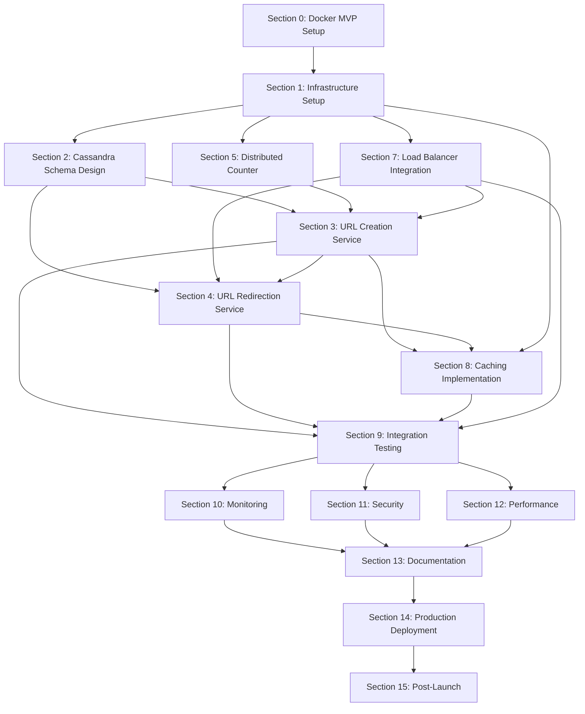

# Project Dependencies

## Dependency Graph

## Section Dependencies

| Section | Name | Dependencies | Notes |
|---------|------|--------------|-------|
| 0 | Docker MVP Setup | None | Foundation - must be done first |
| 1 | Infrastructure Setup | Section 0 | Requires Docker Compose infrastructure |
| 2 | Cassandra Schema Design | Section 1 | Requires Cassandra cluster to be running |
| 3 | URL Creation Service | Sections 1, 2, 5, 7 | Needs Redis counter, Cassandra schema, backend infra, health checks |
| 4 | URL Redirection Service | Sections 1, 2, 3, 7 | Needs Cassandra, Redis cache, URL creation, health checks |
| 5 | Distributed Counter | Section 1 | Requires Redis cluster to be running |
| 6 | Encryption Service | **REMOVED** | URLs now stored as plaintext |
| 7 | Load Balancer Integration | Section 1 | Requires Nginx and backend services |
| 8 | Caching Implementation | Sections 1, 3, 4, 7 | Needs Redis, URL services, and load balancer |
| 9 | Integration & E2E Testing | Sections 1-5, 7-8 | Requires all core services to be functional |
| 10 | Monitoring & Observability | Sections 1-5, 7-9 | Needs working system to monitor |
| 11 | Security & Hardening | Sections 1-5, 7-9 | Needs working system to secure |
| 12 | Performance Testing | Sections 1-5, 7-9 | Needs working system to test |
| 13 | Documentation | Sections 1-12 | Requires all features to be implemented |
| 14 | Production Deployment | Sections 1-13 | Final deployment preparation |
| 15 | Post-Launch & Maintenance | Section 14 | Post-production activities |

## Execution Order Recommendations

### Phase 1: Foundation (Completed ✅)
- **Section 0**: Docker MVP Setup ✅
- **Section 1**: Infrastructure Setup ✅  
- **Section 2**: Cassandra Schema Design ✅

### Phase 2: Core Services (Next Priority)
- **Section 5**: Distributed Counter Implementation (Redis INCR + base62)
- **Section 3**: URL Creation Service (POST /api/v1/urls)
- **Section 4**: URL Redirection Service (GET /:shortId)
- **Section 7**: Load Balancer Integration (health checks, failover)

### Phase 3: Optimization & Testing
- **Section 8**: Caching Implementation (Redis TTL, hit rate)
- **Section 9**: Integration & E2E Testing (full flow validation)
- **Section 10**: Monitoring & Observability (Prometheus, Grafana)
- **Section 11**: Security & Hardening (rate limiting, WAF)

### Phase 4: Production Readiness
- **Section 12**: Performance Testing & Optimization
- **Section 13**: Documentation (API, deployment, runbooks)
- **Section 14**: Production Deployment
- **Section 15**: Post-Launch & Maintenance

## Critical Path

The critical path for MVP functionality is:
**Section 0 → Section 1 → Section 2 → Section 5 → Section 3 → Section 4**

This sequence delivers the core URL shortening functionality:
1. Docker infrastructure
2. Cassandra + Redis infrastructure  
3. Cassandra schema
4. Distributed counter (Redis INCR + base62)
5. URL creation endpoint
6. URL redirection endpoint

All other sections (7-15) are enhancements, testing, security, and production readiness features that can be implemented in parallel or after the critical path is complete.