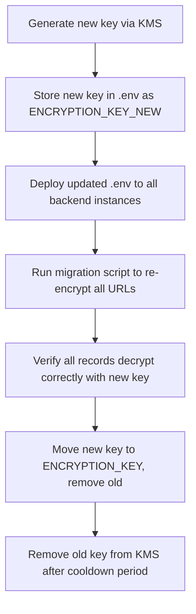

# Encryption Key Management

## Overview

This document details the key management strategy for the AES-256-GCM encryption used to encrypt original URLs at rest in Cassandra.

## Key Generation

### Development Key

Generate a development key using OpenSSL:

```bash
openssl rand -hex 16
```

This produces a 32-character hex string (32 bytes = 256 bits). Set this as `ENCRYPTION_KEY` in your `.env` file:

```env
ENCRYPTION_KEY=a1b2c3d4e5f6a7b8c9d0e1f2a3b4c5d6
```

### Production Key

For production environments, use a cloud KMS to generate and manage keys:

**AWS KMS:**
```bash
# Create a symmetric key
aws kms create-key --description "URL-Shortener-Encryption-Key"

# Generate a data key (returns both plaintext and ciphertext)
aws kms generate-data-key \
  --key-id <key-id> \
  --key-spec AES_256 \
  --output json
```

**Azure Key Vault:**
```bash
# Create a key in Azure Key Vault
az keyvault key create \
  --vault-name <vault-name> \
  --name url-shortener-key \
  --protection hardware \
  --kty RSA-HSM
```

## Key Requirements

| Property | Requirement |
|----------|-------------|
| Algorithm | AES-256-GCM |
| Key Length | Exactly 32 bytes (256 bits) |
| Format | Hex-encoded string (64 characters when hex-encoded) |
| Storage | Never committed to version control |
| Rotation | Every 90 days (production) |

## Key Rotation Strategy

### Rotation Procedure



### Step-by-Step

1. **Generate new key**: Create a new AES-256 key via your chosen KMS.
2. **Dual-key deployment**: Add the new key as `ENCRYPTION_KEY_NEW` in `.env`. The backend reads both keys, decrypts with the old key, and re-encrypts with the new key on read.
3. **Migration**: A scheduled job re-encrypts all URL records (process in batches of 1000 to avoid Cassandra timeouts).
4. **Verification**: Spot-check 1% of records to confirm decryption succeeds with the new key.
5. **Cleanup**: Remove the old key from the KMS after 30-day cooldown.

### Key Rotation Script (Conceptual)

```javascript
// backend/src/rotate-keys.js (conceptual)
const { decrypt, encrypt } = require('./crypto');

async function rotateKeys() {
  const oldKey = process.env.ENCRYPTION_KEY;
  const newKey = process.env.ENCRYPTION_KEY_NEW;

  let pageState = null;
  do {
    const result = await client.execute(
      'SELECT short_id, encrypted_url, iv FROM url_mappings',
      [], { pageState }
    );

    for (const row of result.rows) {
      const originalUrl = decrypt(row.encrypted_url, row.iv, oldKey);
      const { encrypted, iv } = encrypt(originalUrl, newKey);

      await client.execute(
        'UPDATE url_mappings SET encrypted_url = ?, iv = ? WHERE short_id = ?',
        [encrypted, iv, row.short_id]
      );
    }

    pageState = result.pageState;
  } while (pageState);
}
```

## KMS Integration Guide

### AWS KMS

**Architecture:**
```
Backend -> AWS KMS (GenerateDataKey) -> Cache data key in Redis
                                  -> Use cached key for encrypt/decrypt
                                  -> Re-generate key on rotation
```

**Integration:**
1. Install AWS SDK: `npm install @aws-sdk/client-kms`
2. Configure IAM role with `kms:GenerateDataKey` and `kms:Decrypt` permissions.
3. Use KMS to generate data keys rather than storing the master key in `.env`.
4. Cache the data key in Redis (TTL: 1 hour) to reduce KMS API calls.

**Pricing Consideration:** Each `GenerateDataKey` call costs ~$0.03. At 10k req/s, caching aggressively is essential.

### Azure Key Vault

**Architecture:**
```
Backend -> Azure Key Vault (GetKey) -> Cache key in Redis
                                -> Use key for local encrypt/decrypt
```

**Integration:**
1. Install Azure SDK: `npm install @azure/keyvault-keys`
2. Configure managed identity for the backend VM/container.
3. Use `KeyClient.getKey()` to retrieve the key at startup and cache locally.
4. Implement `KeyVaultKeyProvider` class with periodic refresh.

### Local Development Fallback

When KMS is unavailable (local dev), fall back to the `ENCRYPTION_KEY` environment variable:

```javascript
function getEncryptionKey() {
  if (process.env.KMS_PROVIDER === 'aws') {
    return getKeyFromAWSKMS();
  }
  if (process.env.KMS_PROVIDER === 'azure') {
    return getKeyFromAzureVault();
  }
  // Fallback to env var for local development only
  return Buffer.from(process.env.ENCRYPTION_KEY, 'hex');
}
```

## Security Best Practices

1. **Never commit keys**: Add `.env` and `ssl/` to `.gitignore`. Use `.env.example` as a template only.
2. **Least privilege**: The backend IAM role should only have `kms:Decrypt` and `kms:GenerateDataKey` — never `kms:CreateKey` or `kms:ScheduleKeyDeletion`.
3. **Key separation**: Use separate keys for development, staging, and production environments.
4. **Audit logging**: Enable KMS key usage logging via CloudTrail (AWS) or Diagnostic Settings (Azure).
5. **Automatic rotation**: Enable automatic key rotation in KMS (AWS: annual rotation; Azure: set rotation policy).
6. **Encryption context**: Use a unique encryption context (e.g., `{"service":"url-shortener","env":"production"}`) to bind the key to this specific service.
7. **Memory safety**: Zeroize key buffers in memory after use. Avoid logging or exposing key material in error messages.
8. **Backup**: Back up the master key in a secure offline location (HSM, hardware security module) as a final recovery option.
9. **Incident response**: If a key is compromised, rotate immediately following the procedure above. Revoke the compromised key in KMS.